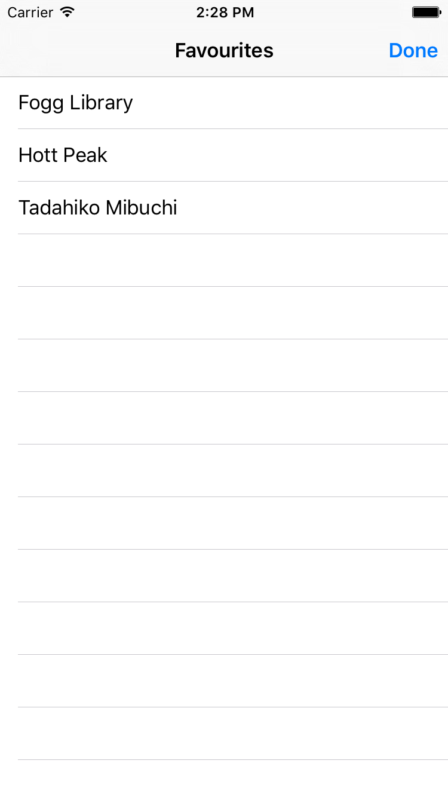
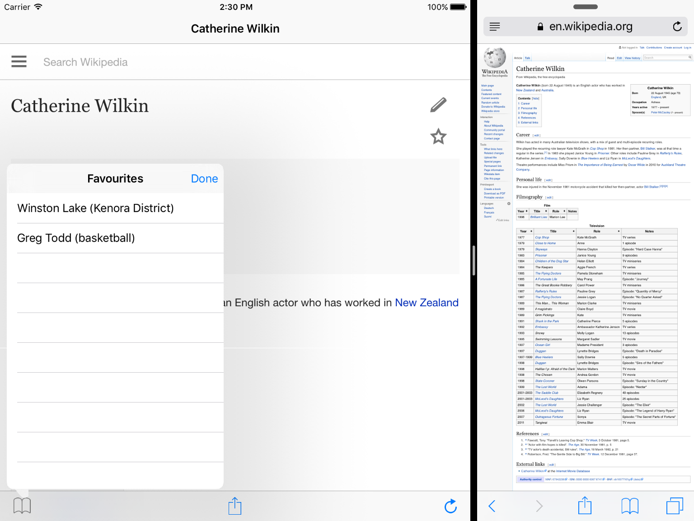

# Wikipedia-Reader
Simple Wikipedia reader 

Application load a random Wikipedia article using this link: https://en.wikipedia.org/wiki/Special:Random . User is able to “re-roll” article if doesn’t like it or finished reading current one. If found interesting article it possible to share it with friends and add it to favorites list.
 
###Technical details:
- Application user interface is compliant with Apple HIG and use standard images provided in SDK.
- Application use Storyboard as it’s interface.
- Application “play” nicely on all of devices supporting iOS9 
- (As it is 2016 now) application use size classes and application should be Universal binary.
- For iPad application should leverage Split View functionality made available in iOS9.

   
    
    
  

